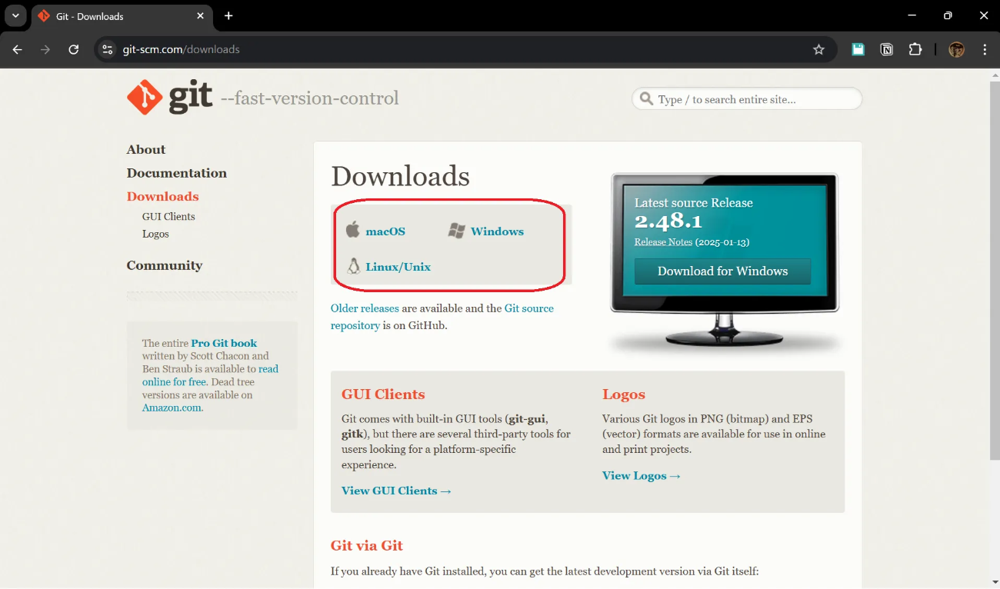
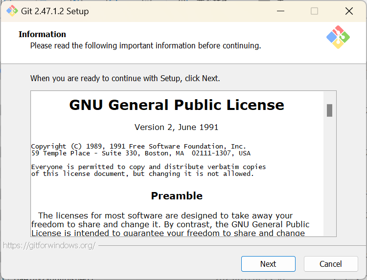

# Gitのインストール
---

1. gitのダウンロードページ([https://git-scm.com/downloads](https://git-scm.com/downloads))にアクセスします
2. 下のようなページに飛びますので自分の使っているPCのOS（大体みんな**Windows**）を選びます
	

3. 選ぶと下のようにダウンロード方法が書いてあります（画像はWindowsを押したもの）今回は`Click here to download`というリンクを押します
	

4. するとインストーラーのダウンロードが始まります。終わったら開いてください
5. 開いたら以下のような画面になります
	

ここからはすべて`Next`を押して最後まできたら`Install`を押してください
これらの選択に関する説明は省きます。とりあえず`Next`のところを連打してください

# GitHubアカウントの作成
---

1. GitHub([https://github.com/](https://github.com/))にサインアップします。リンクを踏むと下のページが開きます
2. 開いたら赤枠の`Sign up`を押します
	

3. 下のような画面になりますので、**項目を記入**します
	

4. 自分が**ロボットではないことを見せつけ**たら以下の画面が出てきますので指示通りメールアドレスに送られてきたコードを入力したら**アカウント作成は終了**です。
	

5. 作成したアカウントにログインしましょう。GitHub([https://github.com/](https://github.com/))のページから"Sign in”を押してログインしましょう。

6. ログインすると以下のような自分のページが出てきます。これでGitHubの準備は終了です。

# （オヌヌメ）GitHubDesktop
---
## What is it？
---

**GitHubDesktop**とは、簡単に言うとGitHubを**初心者向けに使いやすく**してくれたものです。

普通**Git(GitHub)はコマンドラインと言って、下みたいな黒い画面でかちゃかちゃして操作する**ものです。

しかし、初心者にはこれをいじったら**やばそう**とかそもそも**存在を知らない**人もいると思います。

なので、僕はGithubDesktopを使うことを**強く推奨**します。

上のようにさっきの真っ黒い画面よりはマウスで操作できるのでだいぶ**直感的にGit操作**ができるようになっています。

## さぁインストールしよう
---

それでは早速GitHubDesktopのセッティングを行いましょう。

1. GitHubDesktopのページ([https://github.com/apps/desktop](https://github.com/apps/desktop))に飛びます。
    以下のような画面に飛ぶので、 `Download for Windows (64bit)`を押します
    
    
    インストーラーがダウンロードされるのでダウンロードされたら起動します。
    
2. 起動すると、以下の画面になるので`Sign in to GitHub.com`を押す
    
    
    
3. 以下の画面になったら、自分のアカウントに**ログイン**します
    
    
    
4. ログインすると、以下の画面になるので**`Finish`**を押す
押したらインストールは終了です
	